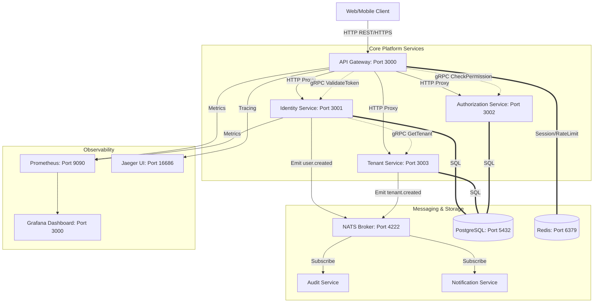
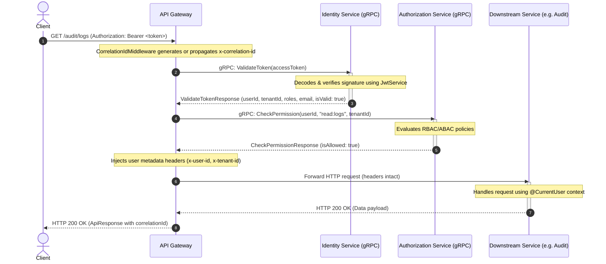

# Enterprise NestJS Core Platform Microservices System Architecture

This document describes the high-performance core microservices blueprint for the enterprise backend.

---

## 1. System Infrastructure Layout

This diagram illustrates how external users access the platform via the API Gateway, and how requests are routed synchronously (gRPC) or asynchronously (NATS) to the internal backing stores and monitoring systems.

---

## 2. Core Request Flow Sequence Diagram

This sequence diagram depicts an API request targeting a protected resource. It illustrates Correlation ID injection, JWT token validation using gRPC, and downstream header forwarding.

---

## 3. Clean Architecture Design Layers

Every microservice in this platform follows the **Clean Architecture** directory pattern, separating code by business rules, application orchestrations, and framework configurations:

1. **Domain Layer (`src/domain/`)**
   - Contains pure business logic aggregates, entities, value objects, and domain exceptions.
   - Absolutely zero references to database ORMs (Prisma) or NestJS frameworks.
2. **Application Layer (`src/application/`)**
   - Holds CQRS commands, queries, application services, and port interfaces (like `IUserRepository`).
   - Drives execution logic and event dispatchers.
3. **Infrastructure Layer (`src/infrastructure/`)**
   - Outlines adapters that implement the domain ports.
   - Houses database repositories (Prisma adapters), HTTP external clients, and NATS event consumers.
4. **Presentation Layer (`src/presentation/`)**
   - Rest REST controllers and gRPC route mappings.
   - Responsible for serializing DTO inputs and handling standard HTTP status responses.

---

## 4. API Gateway Endpoints & Aggregate OpenAPI Specs

### Authentication
- `POST /v1/identity/register`: Creates a new user record. Emits `user.created`.
- `POST /v1/identity/login`: Authenticates user credentials. Returns JWT tokens.
- `POST /v1/identity/refresh`: Re-issues access tokens using refresh tokens.
- `GET /v1/identity/me`: Retrieves current active profile.

### Multi-Tenant Provisioning
- `POST /v1/tenant`: Registers a new tenant and database scoping. Emits `tenant.created`.
- `POST /v1/tenant/organization`: Generates tenant-scoped organizational business unit.

### Authorization Management
- `POST /v1/authorization/assign-role`: Assigns global or tenant-scoped roles.
- `GET /v1/authorization/permissions`: Evaluates and lists active permissions.

---

## 5. Security & Isolation Controls

1. **Correlation IDs**: Propagated via `x-correlation-id` headers across all service boundaries. Allows structured trace logging in Jaeger.
2. **API Rate Limiting**: Managed at the gateway using a sliding-window algorithm backed by Redis.
3. **Multi-Tenant Data Isolation**: Implemented using a shared-database, tenant-discriminator structure. All queries filter by `tenantId` (automatically retrieved from the JWT token and injected via `@CurrentUser`).
4. **Transport Security**: gRPC communication is configured for TLS in production. Internal REST calls bypass the gateway but validate incoming user headers injected by the gateway.
